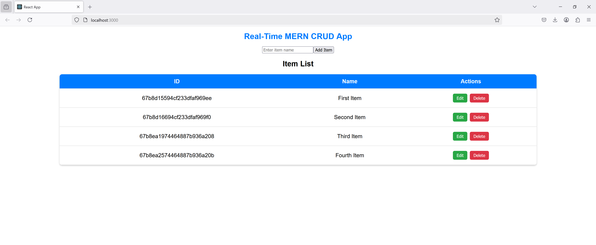
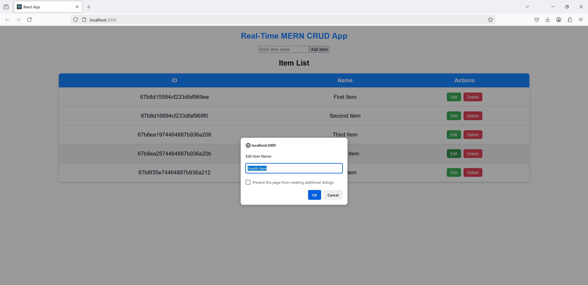
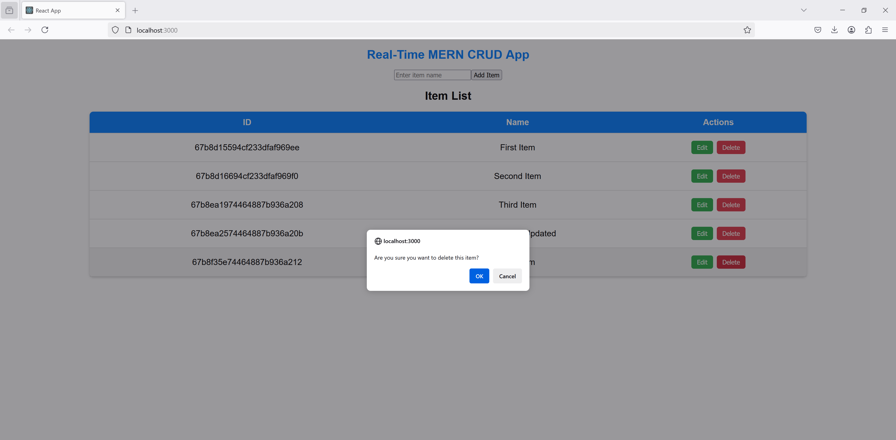
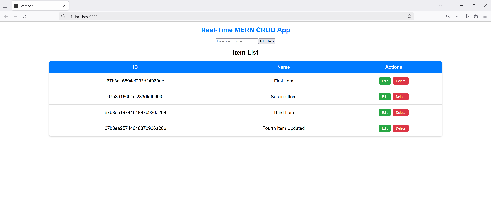
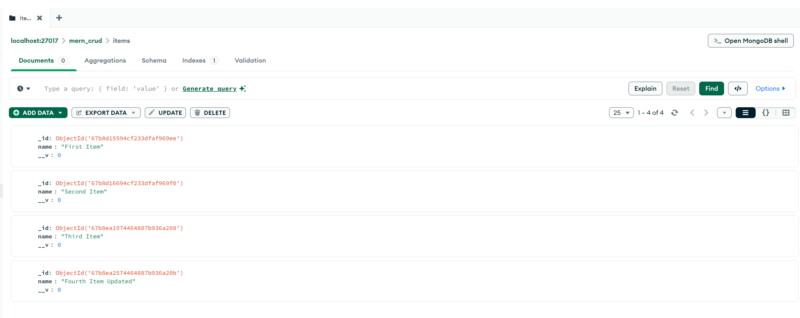

# MERN CRUD Application

## Overview
This is a simple **MERN (MongoDB, Express, React, Node.js)** CRUD application that allows users to:
- **Add an Item**
- **View Item List**
- **Edit an Item**
- **Delete an Item**

This application includes a backend API built with **Express and MongoDB** and a frontend built with **React**.

## Features
- Full CRUD operations: Create, Read, Update, Delete
- RESTful API with Express.js
- MongoDB as the database
- React frontend with basic UI
- Real-time updates using state management

## Project Structure
```
mern-crud-app/
│-- backend/
│   │-- models/
│   │   ├── Item.js
│   │-- routes/
│   │   ├── itemRoutes.js
│   │-- server.js
│-- frontend/
│   │-- src/
│   │   ├── components/
│   │   │   ├── AddItem.js
│   │   │   ├── ItemList.js
│   │   │   ├── EditItem.js
│   │   ├── App.js
│   │   ├── index.js
│-- package.json
│-- README.md
```

## Installation
### Prerequisites
- Node.js
- MongoDB
- npm or yarn

### Backend Setup
1. Navigate to the `backend` directory:
   ```sh
   cd backend
   ```
2. Install dependencies:
   ```sh
   npm install
   ```
3. Start the backend server:
   ```sh
   npm run dev
   ```

### Frontend Setup
1. Navigate to the `frontend` directory:
   ```sh
   cd frontend
   ```
2. Install dependencies:
   ```sh
   npm install
   ```
3. Start the frontend application:
   ```sh
   npm start
   ```

## API Endpoints
| Method | Endpoint | Description |
|--------|---------|-------------|
| GET | `/api/items` | Get all items |
| GET | `/api/items/:id` | Get a single item |
| POST | `/api/items` | Add a new item |
| PUT | `/api/items/:id` | Update an item |
| DELETE | `/api/items/:id` | Delete an item |

## Tech Stack
- **Frontend:** React, React Router, Axios
- **Backend:** Node.js, Express.js, MongoDB, Mongoose
- **Database:** MongoDB (Atlas or Local)

## 📌 Screenshots






## Debug (Update the frontend/package.json file with the following scripts)
```
"scripts": {
"start": "react-scripts --openssl-legacy-provider start",
"build": "react-scripts --openssl-legacy-provider build",
}
```

